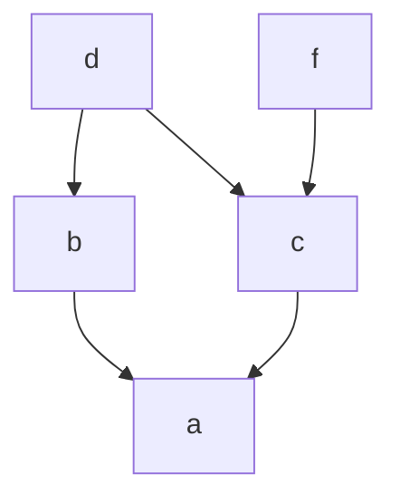

# graphlib

### 說明
依賴任務圖管理工具

### 參考
+ 🔗 [**Python Documentation**](https://docs.python.org/zh-tw/3/library/graphlib.html#graphlib.prepare)

### 類別
| class               | description                                 |
| ------------------- | ------------------------------------------- |
| `TopologicalSorter` | 類別，用於實現有向無環圖（DAG）的拓撲排序。 |


### 方法

+ `TopologicalSorter`

  | function       | description                                      |
  | -------------- | ------------------------------------------------ |
  | `add()`          | 圖中添加任務節點及其依賴項。 |
  | `prepare()`      | 宣告圖已完成，此後不可再新增任務節點，否則將引發 `ValueError`。<br>並檢查圖中是否有 cycle，若有將引發 `CycleError`。 |
  | `get_ready()`    | 一開始返回無依賴項的任務節點，<br>之後每呼叫一次 `done()`，返回因前個任務節點完成而變為無依賴項的任務節點 (`tuple`)。 |
  | `done()`         | 任務節點完成。 |
  | `static_order()` | 返回拓撲排序迭代器。 |
  | `is_active()`    | 檢查是否還有未完成的任務節點。 |


### 使用指南
1. 以選用的初始圖建立 `TopologicalSorter` 的實例。
2. 在圖中新增其他節點。
3. 呼叫圖的 `prepare()`。
4. 當 `is_active()` 為 True 時，疊代 `get_ready()` 回傳的節點並處理它們。在每個節點完成處理時呼叫 `done()`。

### 範例

+ example

  ```py
  from graphlib import TopologicalSorter

  # 定義一個有向無環圖 (DAG)，key 代表任務節點，value 代表任務節點的依賴項
  graph = {"a": ["b", "c"], "b": ["d"], "c": ["d"], "d": []}
  # 拓樸排序器
  sorter = TopologicalSorter(graph)
  # 新增任務節點 (任務節點 c 多一個依賴項 - 任務節點 f)
  sorter.add("c", "f")
  # 宣告圖已完成，此後不可再新增任務節點，並檢查圖中是否有 cycle
  sorter.prepare()

  # 返回當前沒有依賴項的任務節點
  print(sorter.get_ready())
  # ('d', 'f')
  print(sorter.is_active())
  # True

  # 任務節點 f 已完成
  sorter.done("f")
  print(sorter.get_ready())
  # ()
  print(sorter.is_active())
  # True

  # 任務節點 f 已完成
  sorter.done("d")
  print(sorter.get_ready())
  # ('b', 'c')
  print(sorter.is_active())
  # True

  # 任務節點 b 已完成
  sorter.done("b")
  print(sorter.get_ready())
  # ()
  print(sorter.is_active())
  # True

  # 任務節點 c 已完成
  sorter.done("c")
  print(sorter.get_ready())
  # ('a',)
  print(sorter.is_active())
  # True

  # 任務節點 a 已完成
  sorter.done("a")
  print(sorter.get_ready())
  # ()
  print(sorter.is_active())
  # False
  ```

