# time

### 轉換關係

```mermaid

flowchart LR
    %%{init:{"flowchart":{"defaultRenderer":"elk"}}}%%
    struct_time(["時間結構"])
    str(["字串"])
    unix_time(["UNIX時間"])
    time["time()"]

    time --> unix_time
    unix_time -->|"ctime()"| str
    unix_time -->|"gmtime()<br>localtime()"| struct_time
    struct_time -->|"strftime()<br>asctime()"| str
    struct_time -->|"mktime()"| unix_time
    str -->|"strptime()"| struct_time
    
    classDef Bold font-weight: bold
    class struct_time,unix_time,str,time Bold
    classDef Red fill: #B22222
    class struct_time Red
    classDef Green fill: #1B600D
    class str Green
    classDef Blue fill: #2929BC
    class unix_time Blue
    classDef Grey fill:#474949
    class time Grey
    classDef WhiteFont color:#E3E3E3
    class struct_time,str,unix_time,time WhiteFont
```

### 類別
| class                    | return      | description |
| ------------------------ | ----------- | ----------- |
| `struct_time(list[int])` | struct_time | 時間結構    |

### 函數
| function                     | return      | description                                              |
| ---------------------------- | ----------- | -------------------------------------------------------- |
| `time()`                     | float       | UNIX時間 (秒)                                            |
| `localtime(float)`           | struct_time | UNIX時間 (預設現在) ->  時間結構 (當地時間)              |
| `gmtime(float)`              | struct_time | UNIX時間 (預設現在) ->  時間結構 (格林威治標準時間)      |
| `ctime(float)`               | str         | UNIX時間 (預設現在) ->  字串 (格式 : `%a %b %d %H:%M:%S %Y`) |
| `asctime(struct_time)`       | str         | 時間結構 ->  字串 (格式 : `%a %b %d %H:%M:%S %Y`)            |
| `mktime(struct_time)`        | float       | 時間結構 ->  UNIX時間                                     |
| `strftime(fmt, struct_time)` | str         | 時間結構 ->  字串 (指定格式)                              |
| `strptime(str, fmt)`         | struct_time | 字串 ->  時間結構 (指定格式)                              |
| `sleep(float)`               | None        | 讓程式阻塞 (空跑) 指定秒數                               |
| `perf_counter()`             | float       | <mark>benchmark 專用計時</mark> (秒)                                |
| `perf_counter_ns()`          | float       | <mark>benchmark 專用計時</mark> (奈秒)                              |
| `monotonic()`                | float       | ☢️ 單調時鐘 (秒)                                          |
| `monotonic_ns()`             | float       | ☢️ 單調時鐘 (奈秒)                                        |
| `thread_time()`              | float       | 線程所消耗的 CPU 時間 (秒)                               |
| `thread_time_ns()`           | float       | 線程所消耗的 CPU 時間 (奈秒)                             |
| `process_time()`             | float       | 進程所消耗的 CPU 時間 (秒)                               |
| `process_time_ns()`          | float       | 進程所消耗的 CPU 時間 (奈秒)                             |

### 格式 (同 C)
| format | example           | description                                               |
| ------ | ----------------- | --------------------------------------------------------- |
| `%a`   | Sun               | 縮寫星期幾                                                |
| `%A`   | Sunday            | 完整星期幾                                                |
| `%b`   | Mar               | 縮寫月份名稱                                              |
| `%B`   | March             | 完整月份名稱                                              |
| `%c`   | 08/14/22 14:40:43 | 日期時間表示法，等價於 %m/%d/%y %H:%M:%S                  |
| `%d`   | 19                | 一月中的第幾天（01-31）                                   |
| `%H`   | 14                | 24 小時格式（00-23）                                      |
| `%I`   | 05                | 12 小時格式（01-12）                                      |
| `%j`   | 231               | 一年中的第幾天（001-366）                                 |
| `%m`   | 08                | 月份（01-12）                                             |
| `%M`   | 55                | 分（00-59）                                               |
| `%p`   | PM                | AM 或 PM                                                  |
| `%S`   | 02                | 秒（00-61）                                               |
| `%U`   | 33                | 一年中的第幾週（00-53），以第一個星期日作為第一週的第一天 |
| `%w`   | 4                 | 一週當中的星期幾（0-6），星期日表示為 0                   |
| `%W`   | 32                | 一年中的第幾週（00-53），以第一個星期一作為第一週的第一天 |
| `%x`   | 08/14/22          | 日期表示法                                                |
| `%X`   | 14:40:43          | 時間表示法                                                |
| `%y`   | 01                | 縮寫年份（00-99）                                         |
| `%Y`   | 2012              | 年份                                                      |
| `%Z`   | CDT               | 時區                                                      |
| `%%`   | %                 | 一個 % 字元                                               |
